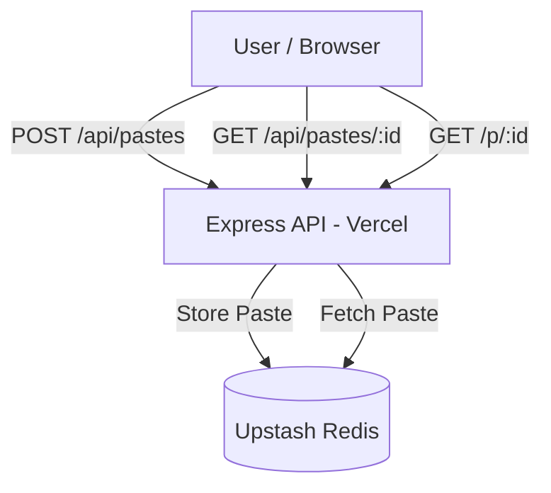

# Pastebin-lite-Clone
A minimal Pastebin-like service that allows users to create text pastes and share links to view them.  
Supports optional expiration (TTL) and view limits.

Built with **Node.js + Express + Redis (Upstash)** and deployed on **Vercel**.

## 🚀 Live Demo

- Base URL:  
  https://paste-bin-clone-sandy.vercel.app  
- Health Check:  
  https://paste-bin-clone-sandy.vercel.app/api/healthz

  ---

## ✅ Features

- Create a paste with arbitrary text

- Receive a shareable URL

- View paste via API or browser

- Optional time-to-live (TTL)

- Optional maximum view count

- Deterministic time support for testing

- Persistent storage using Redis

  ---

### 🧱 Tech Stack

- Node.js

- Express.js

- Upstash Redis

- Vercel

---

### 📦 API
`POST /api/pastes`
```json
{
  "content": "hello",
  "ttl_seconds": 60,
  "max_views": 5
}
```
### ➤ Fetch Paste (API)
`GET /api/pastes/:id`

Returns paste JSON.

### ➤ View Paste (HTML)
`GET /p/:id`

Returns HTML.

### 🗄 Persistence Layer

Upstash Redis (REST).

Chosen because it is serverless-safe and persists across requests.

▶ Run Locally
```bash
npm install
npm start
```


### Create .env :
```env
UPSTASH_REDIS_REST_URL=your_url
UPSTASH_REDIS_REST_TOKEN=your_token
BASE_URL=http://localhost:3000
```
### 🧪 Quick Test
```bash
curl -X POST http://localhost:3000/api/pastes \
-H "Content-Type: application/json" \
-d '{"content":"hello","max_views":2}'
```
### ⚙ Design Notes

- Redis stores JSON blobs

- No in-memory global state

- View counts decremented safely

- Expiry checked on read

### 🔁 Flow

1. User sends request to Express API.
2. API validates input.
3. Paste is stored or fetched from Redis.
4. API enforces TTL and view limits.
5. Response returned to user.

## 🏗 Architecture


### How it will render on GitHub:
---
```yaml
User / Browser  
    │  
    ▼  
Express API (Node.js + Express on Vercel)  
    │  
    ▼  
Upstash Redis (Persistent Storage)
```
